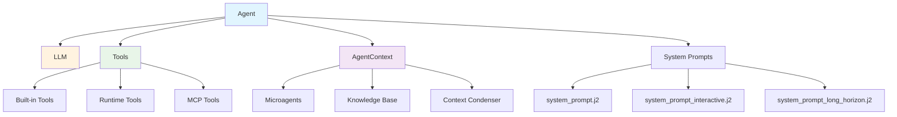
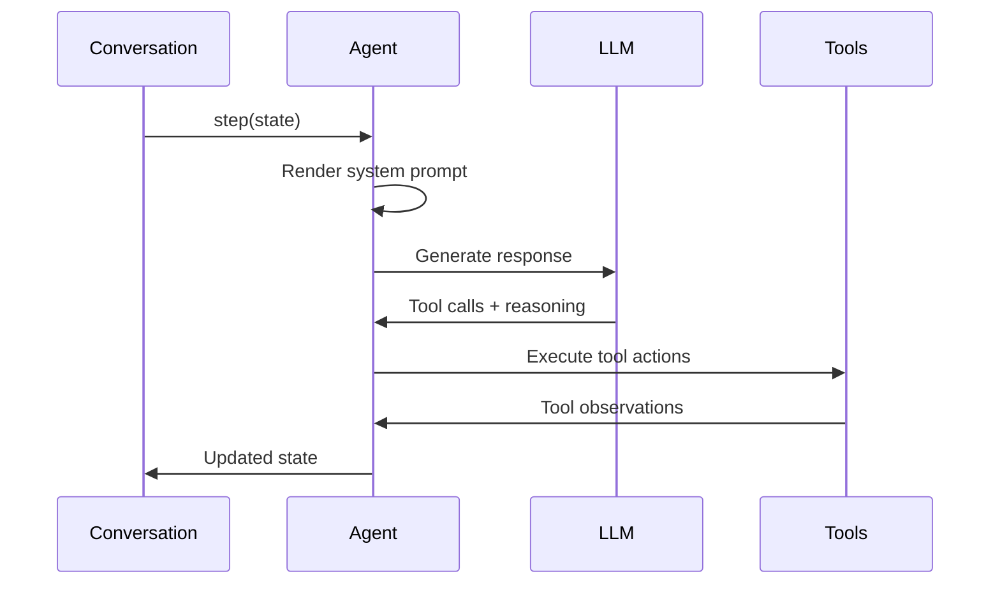

The Agent is the core orchestrator that combines language models with tools to execute tasks. It manages the reasoning loop, tool execution, and state transitions while maintaining conversation context.

## Core Architecture



## Core Classes

### AgentBase
**Source**: [`openhands/sdk/agent/base.py`](https://github.com/All-Hands-AI/agent-sdk/blob/main/openhands/sdk/agent/base.py)

Abstract base class defining the agent interface:

```python
from openhands.sdk.agent import AgentBase
from openhands.sdk.llm import LLM
from openhands.sdk.tool import Tool

class MyAgent(AgentBase):
    def step(self, state: ConversationState) -> ConversationState:
        # Implementation logic
        pass
```

**Key Properties**:
- **Immutable**: All agent instances are frozen Pydantic models
- **Serializable**: Full agent state can be saved and restored
- **Type-safe**: Strict type checking with Pydantic validation

### Agent
**Source**: [`openhands/sdk/agent/agent.py`](https://github.com/All-Hands-AI/agent-sdk/blob/main/openhands/sdk/agent/agent.py)

Main agent implementation with reasoning and tool execution capabilities.

```python
from openhands.sdk import Agent, LLM
from openhands.tools import BashTool, FileEditorTool

agent = Agent(
    llm=llm,
    tools=[
        BashTool.create(),
        FileEditorTool.create(),
    ]
)
```

## Agent Execution Flow

### 1. **Message Processing**


### 2. **Tool Integration**
- **Action Generation**: LLM generates structured tool calls
- **Validation**: Actions validated against tool schemas
- **Execution**: Tools execute with proper error handling
- **Observation**: Results integrated back into conversation

### 3. **Context Management**
- **System Prompts**: Dynamic prompt rendering with context
- **Memory**: Conversation history and state persistence
- **Condensation**: Context compression for long conversations

## System Prompts

**Source**: [`openhands/sdk/agent/prompts/`](https://github.com/All-Hands-AI/agent-sdk/tree/main/openhands/sdk/agent/prompts)

### Available Prompt Templates

#### system_prompt.j2
**Source**: [`system_prompt.j2`](https://github.com/All-Hands-AI/agent-sdk/blob/main/openhands/sdk/agent/prompts/system_prompt.j2)

Default system prompt with tool usage guidelines and reasoning framework.

#### system_prompt_interactive.j2
**Source**: [`system_prompt_interactive.j2`](https://github.com/All-Hands-AI/agent-sdk/blob/main/openhands/sdk/agent/prompts/system_prompt_interactive.j2)

Optimized for interactive, conversational workflows.

#### system_prompt_long_horizon.j2
**Source**: [`system_prompt_long_horizon.j2`](https://github.com/All-Hands-AI/agent-sdk/blob/main/openhands/sdk/agent/prompts/system_prompt_long_horizon.j2)

Designed for complex, multi-step tasks requiring planning.

### Custom Prompts
```python
class MyAgent(Agent):
    system_prompt_filename: str = "my_custom_prompt.j2"
```

Place custom prompts in `prompts/` directory alongside your agent class.

## Agent Context

**Source**: [`openhands/sdk/context/agent_context.py`](https://github.com/All-Hands-AI/agent-sdk/blob/main/openhands/sdk/context/agent_context.py)

Provides additional capabilities beyond basic tool execution:

### Microagents
**Source**: [`openhands/sdk/context/microagents/`](https://github.com/All-Hands-AI/agent-sdk/tree/main/openhands/sdk/context/microagents)

Specialized sub-agents for specific tasks:
```python
from openhands.sdk.context import AgentContext

context = AgentContext(
    microagents=["code_reviewer", "test_generator"]
)

agent = Agent(llm=llm, tools=tools, agent_context=context)
```

### Knowledge Integration
- **Repository context**: Code understanding and navigation
- **Document ingestion**: External knowledge sources
- **Context condensation**: Intelligent memory management

## Configuration

### Basic Agent Setup
```python
from openhands.sdk import Agent, LLM
from openhands.tools import BashTool, FileEditorTool
from pydantic import SecretStr

# Configure LLM
llm = LLM(
    model="anthropic/claude-sonnet-4-20250514",
    api_key=SecretStr("your-api-key"),
)

# Create agent with tools
agent = Agent(
    llm=llm,
    tools=[
        BashTool.create(working_dir="/workspace"),
        FileEditorTool.create(),
    ]
)
```

### Advanced Configuration
```python
from openhands.sdk.context import AgentContext
from openhands.sdk.context.condenser import Condenser

# Advanced context management
context = AgentContext(
    microagents=["code_reviewer"],
    knowledge_base="/path/to/docs"
)

condenser = Condenser(max_tokens=8000)

agent = Agent(
    llm=llm,
    tools=tools,
    agent_context=context,
    condenser=condenser,
    cli_mode=False  # Disable CLI-specific behaviors
)
```

## State Management

### Immutable State
All agent state is immutable - modifications create new instances:

```python
# State transitions create new objects
new_state = agent.step(current_state)
assert new_state is not current_state
```

### Serialization
Full agent state can be serialized for persistence:

```python
# Save agent configuration
agent_json = agent.model_dump_json()

# Restore agent
restored_agent = Agent.model_validate_json(agent_json)
```

## Error Handling

### Tool Execution Errors
- **Validation errors**: Invalid action parameters
- **Execution errors**: Tool runtime failures  
- **Timeout errors**: Long-running operations
- **Permission errors**: Access restrictions

### LLM Integration Errors
- **API errors**: Network or service failures
- **Rate limiting**: Request throttling
- **Token limits**: Context size exceeded
- **Parsing errors**: Invalid tool call format

### Recovery Strategies
```python
try:
    new_state = agent.step(state)
except ValidationError as e:
    # Handle invalid tool parameters
    logger.error(f"Tool validation failed: {e}")
except TimeoutError as e:
    # Handle operation timeouts
    logger.error(f"Operation timed out: {e}")
```

## Performance Considerations

### Context Management
- **Condensation**: Compress conversation history when approaching token limits
- **Selective context**: Include only relevant conversation segments
- **Tool result filtering**: Summarize large tool outputs

### Tool Optimization
- **Executor reuse**: Share executors across tool instances
- **Lazy loading**: Initialize tools only when needed
- **Resource pooling**: Manage connections and file handles

### LLM Efficiency
- **Prompt optimization**: Minimize unnecessary context
- **Streaming responses**: Process partial results
- **Caching**: Reuse responses for identical inputs

## Custom Agent Development

### Extending AgentBase
```python
from openhands.sdk.agent import AgentBase
from openhands.sdk.conversation import ConversationState

class SpecializedAgent(AgentBase):
    def step(self, state: ConversationState) -> ConversationState:
        # Custom reasoning logic
        # Tool selection and execution
        # State management
        return updated_state
    
    @property
    def prompt_dir(self) -> str:
        # Custom prompt directory
        return "/path/to/custom/prompts"
```

### Agent Composition
```python
# Combine multiple agents for complex workflows
class WorkflowAgent(AgentBase):
    planning_agent: Agent
    execution_agent: Agent
    review_agent: Agent
    
    def step(self, state: ConversationState) -> ConversationState:
        # Multi-agent coordination logic
        pass
```

The agent system provides a flexible foundation for building sophisticated AI agents while maintaining type safety, immutability, and clear separation of concerns.
