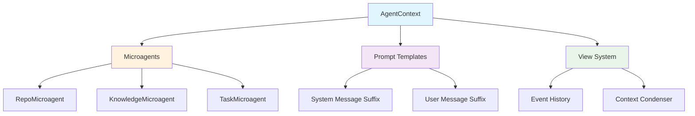

The Context system manages all contextual inputs that shape how agents extend and interpret user prompts. It provides repository context, knowledge injection, and specialized microagents that activate based on conversation content.

## Core Architecture



## Core Classes

### AgentContext
**Source**: [`openhands/sdk/context/agent_context.py`](https://github.com/All-Hands-AI/agent-sdk/blob/main/openhands/sdk/context/agent_context.py)

Central structure for managing prompt extension and contextual inputs.

```python
from openhands.sdk.context import AgentContext, KnowledgeMicroagent

context = AgentContext(
    microagents=[
        KnowledgeMicroagent(
            name="python_expert",
            content="Use type hints and follow PEP 8 standards.",
            triggers=["python", "type hints", "pep8"]
        )
    ],
    system_message_suffix="Repository: my-project\nBranch: main",
    user_message_suffix="Please follow team coding standards."
)
```

**Key Features**:
- **Microagent management**: Validates and organizes specialized agents
- **Prompt extension**: Injects context into system and user messages
- **Knowledge activation**: Triggers relevant knowledge based on user input

### Microagents

> **📖 For detailed information about microagents, see [Microagents Overview](https://docs.all-hands.dev/usage/prompting/microagents-overview)**

#### BaseMicroagent
**Source**: [`openhands/sdk/context/microagents/microagent.py`](https://github.com/All-Hands-AI/agent-sdk/blob/main/openhands/sdk/context/microagents/microagent.py)

Base class for all microagent types with file loading capabilities.

```python
from openhands.sdk.context.microagents import BaseMicroagent
from pathlib import Path

# Load from markdown file with frontmatter
agent = BaseMicroagent.load(Path("microagents/python.md"))

# Load from third-party files (.cursorrules, agents.md)
cursor_agent = BaseMicroagent.load(Path(".cursorrules"))
```

#### RepoMicroagent
Repository-specific knowledge that's always active.

```python
from openhands.sdk.context import RepoMicroagent

repo_agent = RepoMicroagent(
    name="repo_guidelines",
    content="This project uses pytest for testing. All functions need docstrings.",
    source=".openhands/microagents/repo.md"
)
```

**Use Cases**:
- Repository-specific guidelines
- Team practices and conventions
- Project-specific workflows
- Custom documentation references

#### KnowledgeMicroagent
Specialized expertise triggered by keywords in conversations.

```python
from openhands.sdk.context import KnowledgeMicroagent

knowledge_agent = KnowledgeMicroagent(
    name="testing_expert",
    content="Use pytest fixtures for setup. Mock external dependencies.",
    triggers=["test", "pytest", "mock", "fixture"]
)

# Check if triggered
trigger = knowledge_agent.match_trigger("How do I write a pytest fixture?")
# Returns: "pytest"
```

**Use Cases**:
- Language best practices
- Framework guidelines
- Common patterns
- Tool usage instructions

#### TaskMicroagent
Interactive agents that require user input for task execution.

```python
from openhands.sdk.context.microagents import TaskMicroagent

task_agent = TaskMicroagent(
    name="deploy",
    content="Deploy to ${environment} using ${deployment_method}",
    triggers=["/deploy"],
    inputs=[
        {"name": "environment", "description": "Target environment"},
        {"name": "deployment_method", "description": "Deployment strategy"}
    ]
)

# Check if requires input
needs_input = task_agent.requires_user_input()  # True
variables = task_agent.extract_variables(task_agent.content)  # ["environment", "deployment_method"]
```

## Context Flow

### System Message Extension
```python
# AgentContext builds system message suffix
context = AgentContext(microagents=[repo_agent])

# Get system message with repo context
system_suffix = context.get_system_message_suffix()
# Returns formatted text with repository instructions
```

### User Message Augmentation
```python
from openhands.sdk.llm import Message, TextContent

user_message = Message(
    role="user",
    content=[TextContent(text="How do I write Python tests?")]
)

# Get augmented message with triggered knowledge
augmented_content, triggered_agents = context.get_user_message_suffix(
    user_message, 
    skip_microagent_names=[]
)

# Returns: TextContent with testing knowledge + ["testing_expert"]
```

## View System

### View
**Source**: [`openhands/sdk/context/view.py`](https://github.com/All-Hands-AI/agent-sdk/blob/main/openhands/sdk/context/view.py)

Linearly ordered view of events ready for LLM processing.

```python
from openhands.sdk.context.view import View
from openhands.sdk.event import Event

# Create view from event history
events = [message_event, action_event, observation_event]
view = View.from_events(events)

# Access events
print(f"View contains {len(view)} events")
first_event = view[0]
recent_events = view[-3:]  # Last 3 events
```

**Features**:
- **Event filtering**: Respects condensation semantics
- **Summary insertion**: Injects condensed summaries at specified offsets
- **List-like access**: Supports indexing and slicing

### Context Condensation
**Source**: [`openhands/sdk/context/condenser/`](https://github.com/All-Hands-AI/agent-sdk/tree/main/openhands/sdk/context/condenser)

Automatic conversation compression for long sessions.

```python
from openhands.sdk.context.condenser import Condenser
from openhands.sdk.context.view import View

class MyCondenser(Condenser):
    def condense(self, view: View) -> View | Condensation:
        if len(view) > 100:
            # Condense older events
            return self.create_condensation(view)
        return view

# Use with agent
condenser = MyCondenser()
agent = Agent(llm=llm, tools=tools, condenser=condenser)
```

## Microagent Loading

### From Directory
```python
from openhands.sdk.context.microagents import load_microagents_from_dir

# Load all microagents from .openhands/microagents/
repo_agents, knowledge_agents = load_microagents_from_dir(
    ".openhands/microagents"
)

# Combine into context
all_agents = list(repo_agents.values()) + list(knowledge_agents.values())
context = AgentContext(microagents=all_agents)
```

### File Formats

#### Markdown with Frontmatter
```markdown
---
name: python_expert
type: knowledge
triggers: ["python", "type hints", "pep8"]
---

# Python Best Practices

Always use type hints:
```python
def process_data(items: list[str]) -> dict[str, int]:
    return {item: len(item) for item in items}
```

Follow PEP 8 naming conventions.
```

#### Third-Party Files
```python
# .cursorrules file automatically becomes "cursorrules" microagent
# agents.md file automatically becomes "agents" microagent
# .openhands_instructions becomes "repo_legacy" microagent

# These are loaded as RepoMicroagents (always active)
```

## Prompt Templates

### Template Rendering
**Source**: [`openhands/sdk/context/prompts/prompt.py`](https://github.com/All-Hands-AI/agent-sdk/blob/main/openhands/sdk/context/prompts/prompt.py)

Jinja2-based template system for context formatting.

```python
from openhands.sdk.context.prompts import render_template

# Render system message suffix
formatted_text = render_template(
    prompt_dir="templates/",
    template_name="system_message_suffix.j2",
    repo_microagents=repo_agents,
    system_message_suffix="Custom instructions"
)
```

### Template Examples

#### System Message Suffix Template
```jinja2

<REPOSITORY_INSTRUCTIONS>

{{ agent.content }}

</REPOSITORY_INSTRUCTIONS>



{{ system_message_suffix }}

```

#### Knowledge Injection Template
```jinja2
<KNOWLEDGE>

## {{ agent.name }}
{{ agent.content }}

</KNOWLEDGE>
```

## Advanced Usage

### Custom Microagent Types
```python
from openhands.sdk.context.microagents import BaseMicroagent, MicroagentType

class CustomMicroagent(BaseMicroagent):
    type: MicroagentType = MicroagentType.KNOWLEDGE
    
    def custom_logic(self, input_data: str) -> str:
        # Custom processing logic
        return f"Processed: {input_data}"

custom_agent = CustomMicroagent(
    name="custom",
    content="Custom microagent content"
)
```

### Dynamic Context Updates
```python
# Add microagents dynamically
context.microagents.append(new_knowledge_agent)

# Update system message suffix
context.system_message_suffix = "Updated instructions"

# Validate microagent names are unique
try:
    context.model_validate(context.model_dump())
except ValueError as e:
    print(f"Validation error: {e}")
```

### Context Composition
```python
# Combine multiple contexts
base_context = AgentContext(microagents=base_agents)
project_context = AgentContext(microagents=project_agents)

combined_context = AgentContext(
    microagents=base_context.microagents + project_context.microagents,
    system_message_suffix=f"{base_context.system_message_suffix}\n{project_context.system_message_suffix}"
)
```

## Integration Patterns

### With Agent
```python
from openhands.sdk import Agent, LLM
from openhands.sdk.context import AgentContext

# Create context with microagents
context = AgentContext(microagents=microagents)

# Pass to agent
agent = Agent(
    llm=LLM(model="anthropic/claude-sonnet-4-20250514"),
    tools=tools,
    agent_context=context
)
```

### With Conversation
```python
from openhands.sdk import Conversation

# Context automatically used in conversation
conversation = Conversation(agent=agent)

# Microagents activate based on user messages
conversation.send_message(
    Message(role="user", content=[TextContent(text="Help me write Python tests")])
)
# Triggers testing_expert microagent
```

### Repository Integration
```python
import os
from pathlib import Path

def setup_repo_context(repo_path: str) -> AgentContext:
    """Setup context for a specific repository."""
    repo_path = Path(repo_path)
    microagents_dir = repo_path / ".openhands" / "microagents"
    
    if microagents_dir.exists():
        repo_agents, knowledge_agents = load_microagents_from_dir(microagents_dir)
        all_agents = list(repo_agents.values()) + list(knowledge_agents.values())
    else:
        all_agents = []
    
    # Add repository metadata
    system_suffix = f"""
<REPOSITORY_INFO>
Repository: {repo_path.name}
Branch: {os.popen('git branch --show-current').read().strip()}
Working Directory: {repo_path}
</REPOSITORY_INFO>
"""
    
    return AgentContext(
        microagents=all_agents,
        system_message_suffix=system_suffix
    )

# Use with agent
context = setup_repo_context("/path/to/project")
agent = Agent(llm=llm, tools=tools, agent_context=context)
```

## Error Handling

### Validation Errors
```python
from openhands.sdk.context.microagents.exceptions import MicroagentValidationError

try:
    # Duplicate microagent names
    context = AgentContext(microagents=[agent1, agent1])
except ValueError as e:
    print(f"Duplicate microagent name: {e}")

try:
    # Invalid microagent file
    agent = BaseMicroagent.load("invalid.md")
except MicroagentValidationError as e:
    print(f"Microagent validation failed: {e}")
```

### File Loading Errors
```python
try:
    repo_agents, knowledge_agents = load_microagents_from_dir("nonexistent/")
except ValueError as e:
    print(f"Failed to load microagents: {e}")
```

## Performance Considerations

### Microagent Efficiency
- **Trigger matching**: Use specific, non-overlapping triggers
- **Content size**: Keep microagent content concise and focused
- **Loading optimization**: Cache loaded microagents when possible

### Context Management
- **Memory usage**: Limit number of active microagents
- **Template caching**: Jinja2 templates are cached automatically
- **View optimization**: Use condensation for long conversation histories

### Best Practices
- **Microagent organization**: Group related knowledge in single agents
- **Trigger design**: Use distinctive keywords to avoid false positives
- **Content structure**: Format microagent content for easy LLM consumption