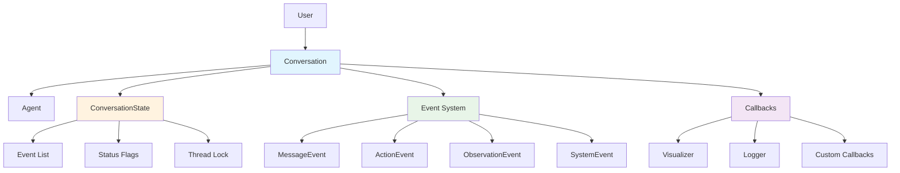

# Conversation System

The Conversation system manages message flow, state transitions, and event handling between users and agents. It provides a stateful interface for interactive AI agent sessions with support for callbacks, visualization, and persistence.

## Core Architecture



## Core Classes

### Conversation
**Source**: [`openhands/sdk/conversation/conversation.py`](https://github.com/All-Hands-AI/agent-sdk/blob/main/openhands/sdk/conversation/conversation.py)

Main conversation orchestrator that manages the interaction loop between users and agents.

```python
from openhands.sdk import Conversation, Agent, Message, TextContent

conversation = Conversation(
    agent=agent,
    max_iteration_per_run=500,
    visualize=True
)

# Send user message
conversation.send_message(
    Message(
        role="user", 
        content=[TextContent(text="Hello, help me with a task")]
    )
)

# Run agent processing
conversation.run()
```

**Key Features**:
- **Stateful sessions**: Maintains conversation history and context
- **Event-driven**: All interactions are captured as events
- **Thread-safe**: Concurrent access protection with locks
- **Extensible**: Custom callbacks for monitoring and integration

### ConversationState
**Source**: [`openhands/sdk/conversation/state.py`](https://github.com/All-Hands-AI/agent-sdk/blob/main/openhands/sdk/conversation/state.py)

Immutable state container for conversation data with thread-safe access.

```python
from openhands.sdk.conversation import ConversationState

# Thread-safe state access
with conversation.state as state:
    print(f"Events: {len(state.events)}")
    print(f"Agent finished: {state.agent_finished}")
```

**State Properties**:
- `id`: Unique conversation identifier
- `events`: Chronological list of all conversation events
- `agent_finished`: Whether agent has completed the task
- `confirmation_mode`: User confirmation required for actions
- `agent_paused`: Agent execution is paused
- `activated_knowledge_microagents`: Active knowledge agents

## Event System

**Source**: [`openhands/sdk/event/`](https://github.com/All-Hands-AI/agent-sdk/tree/main/openhands/sdk/event)

All conversation interactions are captured as typed events.

### Event Types

#### MessageEvent
**Source**: [`MessageEvent`](https://github.com/All-Hands-AI/agent-sdk/blob/main/openhands/sdk/event/types.py)

User or agent messages in the conversation.

```python
from openhands.sdk.event import MessageEvent
from openhands.sdk.llm import Message, TextContent

message_event = MessageEvent(
    message=Message(
        role="user",
        content=[TextContent(text="Please help me")]
    )
)
```

#### ActionEvent
**Source**: [`ActionEvent`](https://github.com/All-Hands-AI/agent-sdk/blob/main/openhands/sdk/event/types.py)

Agent actions (tool calls) during execution.

```python
from openhands.sdk.event import ActionEvent
from openhands.tools import BashAction

action_event = ActionEvent(
    action=BashAction(command="ls -la")
)
```

#### ObservationEvent
**Source**: [`ObservationEvent`](https://github.com/All-Hands-AI/agent-sdk/blob/main/openhands/sdk/event/types.py)

Results from tool executions.

```python
from openhands.sdk.event import ObservationEvent
from openhands.tools import BashObservation

observation_event = ObservationEvent(
    observation=BashObservation(
        content="total 8\ndrwxr-xr-x 2 user user 4096 Jan 1 12:00 .",
        exit_code=0
    )
)
```

#### SystemPromptEvent
System-level events like prompts and configuration changes.

```python
from openhands.sdk.event import SystemPromptEvent

system_event = SystemPromptEvent(
    prompt="You are a helpful AI assistant..."
)
```

## Conversation Flow

### Basic Usage Pattern
```python
from openhands.sdk import Conversation, Agent, LLM, Message, TextContent
from openhands.tools import BashTool, FileEditorTool

# Setup
llm = LLM(model="anthropic/claude-sonnet-4-20250514", api_key=api_key)
agent = Agent(llm=llm, tools=[BashTool.create(), FileEditorTool.create()])
conversation = Conversation(agent=agent)

# Send message
conversation.send_message(
    Message(role="user", content=[TextContent(text="Create a Python script")])
)

# Process with agent
conversation.run()

# Access results
with conversation.state as state:
    for event in state.events:
        print(f"{event.timestamp}: {type(event).__name__}")
```

### Interactive Mode
```python
# Enable confirmation mode
conversation = Conversation(
    agent=agent,
    max_iteration_per_run=1  # Process one step at a time
)

while not conversation.state.agent_finished:
    conversation.run()
    
    # Check if agent needs confirmation
    if conversation.state.agent_waiting_for_confirmation:
        user_input = input("Approve action? (y/n): ")
        if user_input.lower() == 'y':
            conversation.confirm_action()
        else:
            conversation.reject_action()
```

## Callbacks and Visualization

### Built-in Visualizer
**Source**: [`visualizer.py`](https://github.com/All-Hands-AI/agent-sdk/blob/main/openhands/sdk/conversation/visualizer.py)

Real-time conversation visualization in terminal.

```python
# Visualization enabled by default
conversation = Conversation(agent=agent, visualize=True)

# Disable visualization
conversation = Conversation(agent=agent, visualize=False)
```

### Custom Callbacks
**Source**: [`types.py`](https://github.com/All-Hands-AI/agent-sdk/blob/main/openhands/sdk/conversation/types.py)

```python
from openhands.sdk.conversation.types import ConversationCallbackType
from openhands.sdk.event import Event

def my_callback(event: Event) -> None:
    print(f"Event: {type(event).__name__} at {event.timestamp}")

def error_handler(event: Event) -> None:
    if hasattr(event, 'error'):
        logger.error(f"Error in conversation: {event.error}")

conversation = Conversation(
    agent=agent,
    callbacks=[my_callback, error_handler]
)
```

### Callback Composition
```python
from openhands.sdk.conversation.conversation import compose_callbacks

# Combine multiple callbacks
combined_callback = compose_callbacks([
    my_callback,
    error_handler,
    lambda event: print(f"Timestamp: {event.timestamp}")
])

conversation = Conversation(agent=agent, callbacks=[combined_callback])
```

## State Persistence

### Serialization
All conversation state is serializable for persistence.

```python
import json

# Save conversation state
with conversation.state as state:
    state_json = state.model_dump_json()
    with open("conversation.json", "w") as f:
        f.write(state_json)

# Restore conversation state
with open("conversation.json", "r") as f:
    state_data = json.load(f)
    restored_state = ConversationState.model_validate(state_data)
```

### Event Persistence
```python
# Save individual events
events_data = []
with conversation.state as state:
    for event in state.events:
        events_data.append(event.model_dump())

# Restore events
from openhands.sdk.event import Event

restored_events = []
for event_data in events_data:
    event = Event.model_validate(event_data)
    restored_events.append(event)
```

### Database Integration
```python
import sqlite3
from datetime import datetime

class ConversationPersistence:
    def __init__(self, db_path: str):
        self.conn = sqlite3.connect(db_path)
        self.setup_tables()
    
    def setup_tables(self):
        self.conn.execute("""
            CREATE TABLE IF NOT EXISTS conversations (
                id TEXT PRIMARY KEY,
                state TEXT,
                created_at TIMESTAMP,
                updated_at TIMESTAMP
            )
        """)
    
    def save_conversation(self, conversation: Conversation):
        with conversation.state as state:
            self.conn.execute("""
                INSERT OR REPLACE INTO conversations 
                (id, state, created_at, updated_at)
                VALUES (?, ?, ?, ?)
            """, (
                state.id,
                state.model_dump_json(),
                datetime.now(),
                datetime.now()
            ))
            self.conn.commit()
    
    def load_conversation(self, conversation_id: str) -> ConversationState:
        cursor = self.conn.execute(
            "SELECT state FROM conversations WHERE id = ?",
            (conversation_id,)
        )
        row = cursor.fetchone()
        if row:
            return ConversationState.model_validate_json(row[0])
        raise ValueError(f"Conversation {conversation_id} not found")
```

## Advanced Features

### Context Condensation
**Source**: [`condenser/`](https://github.com/All-Hands-AI/agent-sdk/tree/main/openhands/sdk/context/condenser)

Automatic conversation compression for long sessions.

```python
from openhands.sdk.context.condenser import Condenser

condenser = Condenser(max_tokens=8000)
agent = Agent(llm=llm, tools=tools, condenser=condenser)

# Conversation automatically condenses when approaching token limits
conversation = Conversation(agent=agent)
```

### Microagent Integration
**Source**: [`microagents/`](https://github.com/All-Hands-AI/agent-sdk/tree/main/openhands/sdk/context/microagents)

Specialized agents for specific tasks within conversations.

```python
from openhands.sdk.context import AgentContext

context = AgentContext(
    microagents=["code_reviewer", "test_generator", "documentation_writer"]
)

agent = Agent(llm=llm, tools=tools, agent_context=context)
conversation = Conversation(agent=agent)

# Microagents automatically activated based on conversation context
```

### Pause and Resume
```python
# Pause conversation
conversation.pause()

# Check if paused
if conversation.state.agent_paused:
    print("Conversation is paused")

# Resume conversation
conversation.resume()
conversation.run()
```

## Error Handling

### Conversation-Level Errors
```python
from openhands.sdk.event import AgentErrorEvent

def error_callback(event: Event) -> None:
    if isinstance(event, AgentErrorEvent):
        print(f"Agent error: {event.error}")
        # Handle error recovery
        conversation.reset_agent_state()

conversation = Conversation(agent=agent, callbacks=[error_callback])
```

### State Validation
```python
# Validate conversation state
try:
    with conversation.state as state:
        # State operations
        state.events.append(new_event)
except ValidationError as e:
    print(f"State validation failed: {e}")
```

### Thread Safety
```python
import threading

def worker_thread():
    # Each thread must acquire state lock
    with conversation.state as state:
        # Thread-safe state access
        state.events.append(new_event)

# Multiple threads can safely access conversation
threads = [threading.Thread(target=worker_thread) for _ in range(5)]
for t in threads:
    t.start()
for t in threads:
    t.join()
```

## Performance Optimization

### Event Management
- **Event filtering**: Remove unnecessary events from history
- **Batch processing**: Group related events together
- **Memory management**: Clear old events when not needed

### State Optimization
- **Lazy loading**: Load conversation state on demand
- **Compression**: Compress large event payloads
- **Indexing**: Index events by type or timestamp

### Callback Efficiency
- **Async callbacks**: Use async callbacks for I/O operations
- **Selective callbacks**: Only register callbacks for relevant events
- **Callback batching**: Process multiple events in single callback