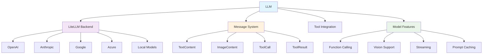

The LLM system provides a unified interface for language model integration with support for multiple providers, function calling, and advanced features like streaming and caching.

## Core Architecture



## Core Classes

### LLM
**Source**: [`openhands/sdk/llm/llm.py`](https://github.com/All-Hands-AI/agent-sdk/blob/main/openhands/sdk/llm/llm.py)

Main LLM interface with provider abstraction and advanced features.

```python
from openhands.sdk.llm import LLM
from pydantic import SecretStr

llm = LLM(
    model="anthropic/claude-sonnet-4-20250514",
    api_key=SecretStr("your-api-key"),
    temperature=0.7,
    max_tokens=4000
)
```

**Key Features**:
- **Provider agnostic**: Works with OpenAI, Anthropic, Google, Azure, and local models
- **Function calling**: Native and non-native tool integration
- **Streaming**: Real-time response processing
- **Caching**: Prompt caching for efficiency
- **Metrics**: Token usage and performance tracking

### Message System
**Source**: [`openhands/sdk/llm/message.py`](https://github.com/All-Hands-AI/agent-sdk/blob/main/openhands/sdk/llm/message.py)

Typed message system compatible with MCP (Model Context Protocol).

```python
from openhands.sdk.llm import Message, TextContent, ImageContent

message = Message(
    role="user",
    content=[
        TextContent(text="Analyze this image"),
        ImageContent(url="https://example.com/image.jpg")
    ]
)
```

## Supported Providers

### OpenAI
```python
llm = LLM(
    model="openai/gpt-4o",
    api_key=SecretStr(os.getenv("OPENAI_API_KEY")),
    base_url="https://api.openai.com/v1"  # Optional custom endpoint
)
```

### Anthropic
```python
llm = LLM(
    model="anthropic/claude-sonnet-4-20250514",
    api_key=SecretStr(os.getenv("ANTHROPIC_API_KEY")),
    max_tokens=8192
)
```

### Google (Gemini)
```python
llm = LLM(
    model="google/gemini-pro",
    api_key=SecretStr(os.getenv("GOOGLE_API_KEY"))
)
```

### Azure OpenAI
```python
llm = LLM(
    model="azure/gpt-4o",
    api_key=SecretStr(os.getenv("AZURE_API_KEY")),
    api_base=os.getenv("AZURE_API_BASE"),
    api_version="2024-02-15-preview"
)
```

### Local Models (Ollama, vLLM, etc.)
```python
# Ollama
llm = LLM(
    model="ollama/llama3.1",
    base_url="http://localhost:11434"
)

# vLLM
llm = LLM(
    model="openai/meta-llama/Llama-3.1-8B-Instruct",
    base_url="http://localhost:8000/v1"
)
```

## Message Types

### TextContent
**Source**: [`TextContent`](https://github.com/All-Hands-AI/agent-sdk/blob/main/openhands/sdk/llm/message.py)

Standard text messages with optional prompt caching.

```python
from openhands.sdk.llm import TextContent

content = TextContent(
    text="Your message here",
    cache_prompt=True  # Enable prompt caching
)
```

### ImageContent
**Source**: [`ImageContent`](https://github.com/All-Hands-AI/agent-sdk/blob/main/openhands/sdk/llm/message.py)

Image inputs for vision-capable models.

```python
from openhands.sdk.llm import ImageContent

# URL-based image
image_content = ImageContent(
    url="https://example.com/image.jpg"
)

# Base64-encoded image
image_content = ImageContent(
    data="data:image/jpeg;base64,/9j/4AAQSkZJRgABAQAAAQ..."
)
```

### ToolCall & ToolResult
Function calling integration with structured tool interactions.

```python
from openhands.sdk.llm import ToolCall, ToolResult

# Tool call from LLM
tool_call = ToolCall(
    id="call_123",
    function={"name": "bash_tool", "arguments": '{"command": "ls -la"}'}
)

# Tool result back to LLM
tool_result = ToolResult(
    tool_call_id="call_123",
    content="total 8\ndrwxr-xr-x 2 user user 4096 Jan 1 12:00 ."
)
```

## Advanced Features

### Function Calling
**Source**: [`mixins/fn_call_converter.py`](https://github.com/All-Hands-AI/agent-sdk/blob/main/openhands/sdk/llm/mixins/fn_call_converter.py)

Automatic tool schema generation and function calling.

```python
from openhands.tools import BashTool, FileEditorTool

tools = [BashTool.create(), FileEditorTool.create()]

# LLM automatically gets tool schemas
response = llm.completion(
    messages=[message],
    tools=tools  # Tools converted to function schemas
)
```

### Non-Native Function Calling
**Source**: [`mixins/non_native_fc.py`](https://github.com/All-Hands-AI/agent-sdk/blob/main/openhands/sdk/llm/mixins/non_native_fc.py)

Function calling support for models without native capabilities.

```python
# Automatically handles models without native function calling
llm = LLM(model="ollama/llama3.1")  # No native function calling
response = llm.completion(messages=[message], tools=tools)  # Still works!
```

### Streaming
```python
# Streaming responses
for chunk in llm.completion_stream(messages=[message]):
    if chunk.choices[0].delta.content:
        print(chunk.choices[0].delta.content, end="")
```

### Prompt Caching
```python
# Cache system prompts for efficiency
system_message = Message(
    role="system",
    content=[TextContent(
        text="Long system prompt...",
        cache_prompt=True  # Cache this content
    )]
)
```

## Model Features Detection

**Source**: [`utils/model_features.py`](https://github.com/All-Hands-AI/agent-sdk/blob/main/openhands/sdk/llm/utils/model_features.py)

Automatic detection of model capabilities.

```python
from openhands.sdk.llm.utils.model_features import get_features

features = get_features("anthropic/claude-sonnet-4-20250514")
print(features.supports_function_calling)  # True
print(features.supports_vision)  # True
print(features.supports_caching)  # True
```

## Metrics and Telemetry

### Usage Metrics
**Source**: [`utils/metrics.py`](https://github.com/All-Hands-AI/agent-sdk/blob/main/openhands/sdk/llm/utils/metrics.py)

Track token usage and costs.

```python
# Metrics are automatically tracked
response = llm.completion(messages=[message])

# Access metrics
print(f"Input tokens: {response.usage.prompt_tokens}")
print(f"Output tokens: {response.usage.completion_tokens}")
print(f"Total cost: ${response.cost}")
```

### Telemetry
**Source**: [`utils/telemetry.py`](https://github.com/All-Hands-AI/agent-sdk/blob/main/openhands/sdk/llm/utils/telemetry.py)

Performance monitoring and debugging.

```python
# Telemetry data automatically collected
# - Response times
# - Error rates  
# - Model performance
# - Token efficiency
```

## Configuration

### Basic Configuration
```python
from openhands.sdk.llm import LLM
from pydantic import SecretStr

llm = LLM(
    model="anthropic/claude-sonnet-4-20250514",
    api_key=SecretStr("your-api-key"),
    temperature=0.7,
    max_tokens=4000,
    timeout=30.0
)
```

### Advanced Configuration
```python
llm = LLM(
    model="openai/gpt-4o",
    api_key=SecretStr("your-api-key"),
    
    # Generation parameters
    temperature=0.7,
    max_tokens=4000,
    top_p=0.9,
    frequency_penalty=0.0,
    presence_penalty=0.0,
    
    # Request configuration
    timeout=30.0,
    max_retries=3,
    base_url="https://api.openai.com/v1",
    
    # Custom headers
    extra_headers={"Custom-Header": "value"},
    
    # Streaming
    stream=False,
    
    # Function calling
    tool_choice="auto"  # or "none", "required", or specific tool
)
```

## Error Handling

### Common Exceptions
**Source**: [`exceptions.py`](https://github.com/All-Hands-AI/agent-sdk/blob/main/openhands/sdk/llm/exceptions.py)

```python
from openhands.sdk.llm.exceptions import LLMNoResponseError
from litellm.exceptions import RateLimitError, APIConnectionError

try:
    response = llm.completion(messages=[message])
except RateLimitError:
    # Handle rate limiting
    time.sleep(60)
except APIConnectionError:
    # Handle network issues
    logger.error("Failed to connect to LLM API")
except LLMNoResponseError:
    # Handle empty responses
    logger.error("LLM returned no response")
```

### Retry Logic
**Source**: [`utils/retry_mixin.py`](https://github.com/All-Hands-AI/agent-sdk/blob/main/openhands/sdk/llm/utils/retry_mixin.py)

Automatic retry with exponential backoff.

```python
# Retries are handled automatically
llm = LLM(
    model="openai/gpt-4o",
    max_retries=3,  # Retry up to 3 times
    retry_delay=1.0  # Initial delay between retries
)
```

## LLM Registry

**Source**: [`llm_registry.py`](https://github.com/All-Hands-AI/agent-sdk/blob/main/openhands/sdk/llm/llm_registry.py)

Centralized LLM instance management and reuse.

```python
from openhands.sdk.llm import LLMRegistry

# Register LLM instance
registry = LLMRegistry()
registry.register("default", llm)

# Reuse registered instance
llm_instance = registry.get("default")
```

## Performance Optimization

### Token Management
- **Prompt caching**: Cache frequently used system prompts
- **Context compression**: Truncate long conversations intelligently
- **Selective content**: Include only relevant message history

### Request Optimization
- **Batch processing**: Group multiple requests when possible
- **Connection pooling**: Reuse HTTP connections
- **Async operations**: Use async/await for concurrent requests

### Cost Management
- **Model selection**: Choose appropriate model for task complexity
- **Token limits**: Set reasonable max_tokens to control costs
- **Usage monitoring**: Track token consumption and costs

## Custom LLM Integration

### Extending LLM Class
```python
from openhands.sdk.llm import LLM

class CustomLLM(LLM):
    def completion(self, messages, **kwargs):
        # Custom completion logic
        # Must return ModelResponse compatible object
        pass
    
    def completion_stream(self, messages, **kwargs):
        # Custom streaming logic
        # Must yield ModelResponse compatible chunks
        pass
```

### Provider-Specific Features
```python
# Anthropic-specific features
if llm.model.startswith("anthropic/"):
    # Use Claude-specific optimizations
    pass

# OpenAI-specific features  
if llm.model.startswith("openai/"):
    # Use GPT-specific features
    pass
```
