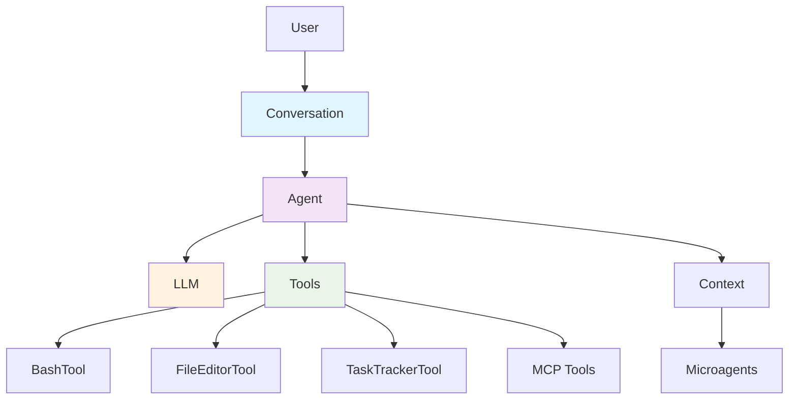

The OpenHands Agent SDK provides a modular framework for building AI agents with tool integration capabilities. All core classes are **immutable** and **serializable**, enabling reliable state management and persistence.

## Core Components



## Component Interactions

### 1. **Conversation** → **Agent** → **LLM** + **Tools**
- **Conversation** manages message flow and state
- **Agent** orchestrates LLM reasoning with tool execution
- **LLM** provides language understanding and generation
- **Tools** enable external actions (bash, file editing, web requests, etc.)

### 2. **Context** provides additional capabilities
- **Microagents** for specialized sub-tasks
- **Repository knowledge** and **document ingestion**
- **Agent context** for maintaining state across interactions

### 3. **MCP Integration** extends tool ecosystem
- **Model Context Protocol** for standardized tool interfaces
- **External services** integration (APIs, databases, etc.)
- **Dynamic tool discovery** and registration

## Design Principles

### Immutability & Serialization
All core classes are designed to be:
- **Immutable**: State changes create new instances
- **Serializable**: Full conversation state can be saved/restored
- **Type-safe**: Pydantic models ensure data integrity

### Modularity
- **Composable**: Mix and match components as needed
- **Extensible**: Add custom tools, LLMs, or context providers
- **Testable**: Each component can be tested in isolation

### Backward Compatibility
- **Breaking changes** will be documented but not avoided
- **Semantic versioning** indicates compatibility levels
- **Migration guides** provided for major changes

## Component Documentation

- **[Tools](./tool.mdx)** - Tool system, inheritance, and MCP integration
- **[Agent](./agent.mdx)** - Agent architecture and execution flow
- **[LLM](./llm.mdx)** - Language model integration and providers
- **[Conversation](./conversation.mdx)** - Message flow and persistence

## Package Structure

```
openhands/
├── sdk/                    # Core framework
│   ├── agent/             # Agent orchestration
│   ├── conversation/      # Message flow and state
│   ├── llm/              # Language model integration
│   ├── tool/             # Tool framework and built-ins
│   ├── context/          # Context management and microagents
│   ├── mcp/              # Model Context Protocol integration
│   └── utils/            # Shared utilities
└── tools/                 # Runtime tool implementations
    ├── execute_bash/      # BashTool
    ├── str_replace_editor/ # FileEditorTool
    └── task_tracker/      # TaskTrackerTool
```

## Testing Strategy

- **Unit tests** per package (`openhands/sdk/tests`, `openhands/tools/tests`)
- **Integration tests** under `tests/`
- **Pre-commit hooks** run ruff, pyright, and pycodestyle
- **Type checking** with pyright (strict mode)
