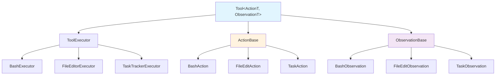

# Tool System

The OpenHands Agent SDK provides a flexible tool system that enables agents to interact with external systems and perform actions. Tools follow a typed action/observation pattern and support both built-in and runtime implementations.

## Core Architecture



## Core Framework Classes

### Tool[ActionT, ObservationT]
**Source**: [`openhands/sdk/tool/tool.py`](https://github.com/All-Hands-AI/agent-sdk/blob/main/openhands/sdk/tool/tool.py)

Base class for all tools with typed action and observation parameters.

```python
from openhands.sdk.tool import Tool, ActionBase, ObservationBase

class MyTool(Tool[MyAction, MyObservation]):
    def create_executor(self) -> ToolExecutor[MyAction, MyObservation]:
        return MyExecutor()
```

### ActionBase & ObservationBase
**Source**: [`openhands/sdk/tool/schema.py`](https://github.com/All-Hands-AI/agent-sdk/blob/main/openhands/sdk/tool/schema.py)

Base classes for tool inputs and outputs:
- **ActionBase**: Defines tool input parameters and validation
- **ObservationBase**: Defines tool output structure and metadata

### ToolExecutor
**Source**: [`openhands/sdk/tool/tool.py`](https://github.com/All-Hands-AI/agent-sdk/blob/main/openhands/sdk/tool/tool.py)

Handles the actual execution logic for tools. Executors are stateful and can maintain resources like file handles or network connections.

## Built-in Tools

**Source**: [`openhands/sdk/tool/builtins`](https://github.com/All-Hands-AI/agent-sdk/tree/main/openhands/sdk/tool/builtins)

### FinishTool
**Source**: [`openhands/sdk/tool/builtins/finish.py`](https://github.com/All-Hands-AI/agent-sdk/blob/main/openhands/sdk/tool/builtins/finish.py)

Signals task completion with optional output.

```python
from openhands.sdk.tool.builtins import FinishTool

finish_tool = FinishTool.create()
```

### ThinkTool  
**Source**: [`openhands/sdk/tool/builtins/think.py`](https://github.com/All-Hands-AI/agent-sdk/blob/main/openhands/sdk/tool/builtins/think.py)

Enables internal reasoning without external actions.

```python
from openhands.sdk.tool.builtins import ThinkTool

think_tool = ThinkTool.create()
```

## Runtime Tools

**Source**: [`openhands/tools`](https://github.com/All-Hands-AI/agent-sdk/tree/main/openhands/tools)

### BashTool
**Source**: [`openhands/tools/execute_bash/definition.py`](https://github.com/All-Hands-AI/agent-sdk/blob/main/openhands/tools/execute_bash/definition.py)

Execute bash commands in a persistent shell session.

```python
from openhands.tools import BashTool

bash_tool = BashTool.create(working_dir="/path/to/work")
```

**Features**:
- Persistent shell session with environment variables
- Working directory management
- Command timeout and interruption support
- Output streaming and truncation

### FileEditorTool
**Source**: [`openhands/tools/str_replace_editor/definition.py`](https://github.com/All-Hands-AI/agent-sdk/blob/main/openhands/tools/str_replace_editor/definition.py)

Create, view, and edit files with precise string replacement.

```python
from openhands.tools import FileEditorTool

editor_tool = FileEditorTool.create()
```

**Operations**:
- `view`: Display file contents with line numbers
- `create`: Create new files with content
- `str_replace`: Replace exact string matches
- `insert`: Insert content at specific line numbers

### TaskTrackerTool
**Source**: [`openhands/tools/task_tracker/definition.py`](https://github.com/All-Hands-AI/agent-sdk/blob/main/openhands/tools/task_tracker/definition.py)

Manage development tasks and track progress.

```python
from openhands.tools import TaskTrackerTool

tracker_tool = TaskTrackerTool.create()
```

**Commands**:
- `view`: Display current task list
- `plan`: Create or update task list with status tracking

## Usage Patterns

### Simplified Pattern (Recommended)
```python
from openhands.tools import BashTool, FileEditorTool, TaskTrackerTool

tools = [
    BashTool.create(working_dir=os.getcwd()),
    FileEditorTool.create(),
    TaskTrackerTool.create(),
]
```

### Advanced Pattern (Custom Configuration)
```python
from openhands.tools import BashExecutor, execute_bash_tool

# Explicit executor creation for reuse or customization
bash_executor = BashExecutor(working_dir=os.getcwd())
bash_tool = execute_bash_tool.set_executor(executor=bash_executor)
```

## MCP Integration

**Source**: [`openhands/sdk/mcp/`](https://github.com/All-Hands-AI/agent-sdk/tree/main/openhands/sdk/mcp)


The OpenHands Agent SDK provides seamless integration with the [Model Context Protocol (MCP)](https://modelcontextprotocol.io/), enabling agents to connect to external tools and services through a standardized protocol.


### Creating MCP Tools
```python
from openhands.sdk import create_mcp_tools

# Configure MCP servers
mcp_config = {
    "mcpServers": {
        "fetch": {
            "command": "uvx",
            "args": ["mcp-server-fetch"]
        },
        "filesystem": {
            "transport": "stdio",
            "command": "python",
            "args": ["./mcp-server-filesystem.py"]
        }
    }
}

# Create MCP tools
mcp_tools = create_mcp_tools(mcp_config, timeout=30)
```

### MCP Configuration Formats

OpenHands Agent SDK uses the [FastMCP configuration format](https://gofastmcp.com/clients/client#configuration-format), which provides a standardized way to configure MCP servers.

```python
config = {
    "mcpServers": {
        "server_name": {
            # Remote HTTP/SSE server
            "transport": "http",  # or "sse" 
            "url": "https://api.example.com/mcp",
            "headers": {"Authorization": "Bearer token"},
            "auth": "oauth"  # or bearer token string
        },
        "local_server": {
            # Local stdio server
            "transport": "stdio",
            "command": "python",
            "args": ["./server.py", "--verbose"],
            "env": {"DEBUG": "true"},
            "cwd": "/path/to/server",
        }
    }
}

### Combining Built-in and MCP Tools
```python
from openhands.tools import BashTool, FileEditorTool
from openhands.sdk import create_mcp_tools

# Standard tools
tools = [
    BashTool.create(working_dir=os.getcwd()),
    FileEditorTool.create(),
]

# Add MCP tools
mcp_tools = create_mcp_tools(mcp_config)
tools.extend(mcp_tools)

# Use with agent
agent = Agent(llm=llm, tools=tools)
```

## Tool Development

### Creating Custom Tools
```python
from pydantic import BaseModel
from openhands.sdk.tool import Tool, ActionBase, ObservationBase, ToolExecutor

class MyAction(ActionBase):
    command: str
    timeout: int = 30

class MyObservation(ObservationBase):
    result: str
    success: bool

class MyExecutor(ToolExecutor[MyAction, MyObservation]):
    def execute(self, action: MyAction) -> MyObservation:
        # Implementation logic
        return MyObservation(result="output", success=True)

class MyTool(Tool[MyAction, MyObservation]):
    def create_executor(self) -> MyExecutor:
        return MyExecutor()
    
    @classmethod
    def create(cls) -> "MyTool":
        return cls()
```

### Tool Registration
Tools are automatically discovered and registered when imported. The agent system uses the tool's schema to generate appropriate function calls for the LLM.

## Security Considerations

Tools can execute arbitrary code and access system resources. The framework provides:
- **Input validation** through Pydantic schemas
- **Timeout controls** for long-running operations
- **Working directory isolation** for file operations
- **Command sanitization** for shell operations

Always validate tool inputs and consider the security implications of tool capabilities in your agent deployments.
