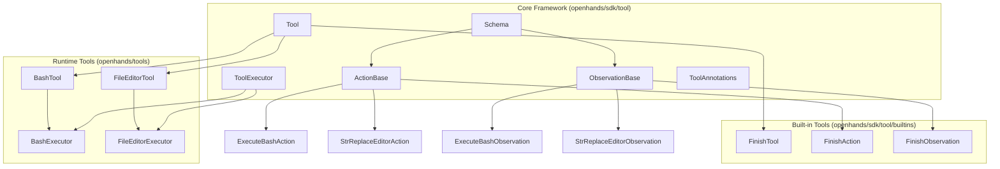
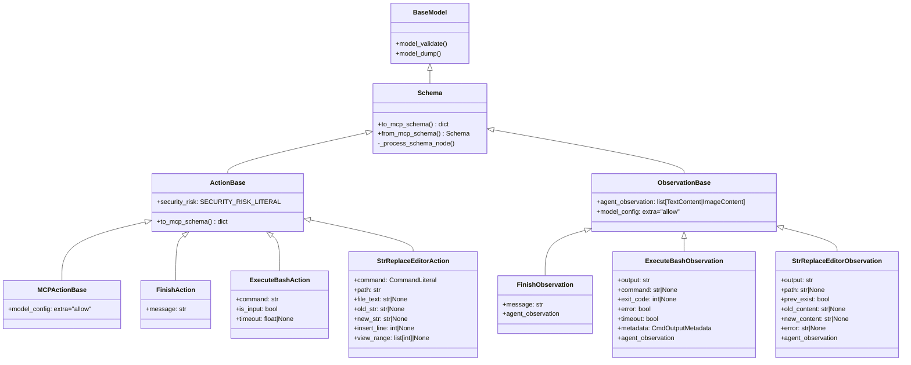

# OpenHands Tools System

## What it is

A type-safe tool execution framework with Pydantic schema validation and MCP compatibility. Tools wrap executors with input/output validation and provide standardized interfaces for LLM function calling.

## Architecture Overview



## Core Components

### Schema Base Classes

**Schema** - Base for all input/output schemas
- Converts Pydantic models to MCP-compatible JSON schemas
- Handles schema normalization and validation
- Supports dynamic model creation from JSON schemas

**ActionBase** - Input schema for tool actions
- Inherits from Schema
- Includes security_risk field for LLM safety assessment
- Moves ActionBase fields to end of schema for better LLM ordering

**ObservationBase** - Output schema for tool results
- Inherits from Schema
- Requires agent_observation property for LLM consumption
- Allows extra fields for flexibility

### Tool Framework

**Tool** - Generic tool wrapper with validation
- Type parameters: `Tool[ActionT, ObservationT]`
- Validates inputs before execution
- Coerces outputs to expected types
- Exports MCP and OpenAI tool descriptions

**ToolExecutor** - Callable interface for tool logic
- Generic type: `ToolExecutor[ActionT, ObservationT]`
- Implements `__call__(action: ActionT) -> ObservationT`

**ToolAnnotations** - MCP-compatible tool metadata
- readOnlyHint: Tool doesn't modify environment
- destructiveHint: Tool may perform destructive updates
- idempotentHint: Repeated calls have no additional effect
- openWorldHint: Tool interacts with external entities

## Usage Patterns

### Simplified Pattern (Recommended)

```python
from openhands.tools import BashTool, FileEditorTool

# Direct instantiation
tools = [
    BashTool(working_dir="/workspace"),
    FileEditorTool(),
]
```

### Advanced Pattern (Custom Tools)

```python
from openhands.tools import BashExecutor, execute_bash_tool

# Explicit executor for reuse
executor = BashExecutor(working_dir="/workspace")
tool = execute_bash_tool.set_executor(executor)
```

### Creating Custom Tools

```python
from openhands.sdk.tool import Tool, ActionBase, ObservationBase, ToolExecutor
from pydantic import Field

class MyAction(ActionBase):
    input_text: str = Field(description="Text to process")

class MyObservation(ObservationBase):
    result: str = Field(description="Processed result")
    
    @property
    def agent_observation(self):
        return [TextContent(text=self.result)]

class MyExecutor(ToolExecutor):
    def __call__(self, action: MyAction) -> MyObservation:
        return MyObservation(result=f"Processed: {action.input_text}")

my_tool = Tool(
    name="my_tool",
    description="Processes text input",
    input_schema=MyAction,
    output_schema=MyObservation,
    executor=MyExecutor()
)
```

## Pydantic Class Inheritance



## Tool Execution Flow


## Built-in vs Runtime Tools

**Built-in Tools** (`openhands/sdk/tool/builtins`)
- Essential tools required for agent operation
- No environment interaction
- Example: FinishTool for task completion

**Runtime Tools** (`openhands/tools`)
- Environment-interactive tools
- Separate package for modularity
- Examples: BashTool, FileEditorTool

## Security Integration

All ActionBase schemas include security_risk assessment:
- LOW: Read-only operations
- MEDIUM: Container-scoped modifications  
- HIGH: Data exfiltration or privilege escalation
- UNKNOWN: Default for weaker LLMs

## MCP Compatibility

Tools export MCP-compatible schemas via:
- `to_mcp_tool()`: Full MCP tool description
- `to_openai_tool()`: OpenAI function calling format
- Schema normalization removes Pydantic-specific constructs

## Key Design Principles

1. **Type Safety**: Generic Tool[ActionT, ObservationT] ensures compile-time correctness
2. **Schema Flexibility**: Support both Pydantic classes and raw JSON schemas
3. **Validation**: Input validation before execution, output coercion after
4. **Separation**: Core framework separate from environment-specific tools
5. **Standards**: MCP compatibility for interoperability