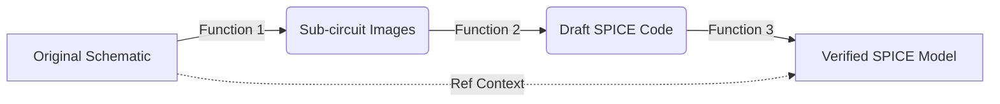

# Schematic-to-SPICE Conversion Pipeline

This document outlines the three-stage architecture for converting high-resolution circuit schematics into modular, simulation-ready SPICE models. The pipeline moves from visual segmentation to code generation, concluding with an automated audit.

-----

## Function 1: Semantic Segmentation (Visual Pre-processing)

**Objective:** Divide complex, high-resolution schematics into manageable, self-contained visual blocks.

  * **Type:** Deterministic ML Pipeline (Non-Agentic).
  * **Core Technology:** **SAMv3** (Segment Anything Model) with Promptable Context Segmentation.
  * **Workflow:**
    1.  Ingests the raw high-resolution schematic image.
    2.  Applies SAMv3 using specific prompt keywords: `"Circuit"`, `"Schematic"`.
    3.  Extracts bounding boxes for functional clusters (e.g., Power Supply block, MCU block).
    4.  Crops and saves these segments as individual image files in local storage.
  * **Key Output:** A directory of segmented sub-circuit images (PNG/JPG).

-----

## Function 2: SPICE Extraction Agent (Generation)

**Objective:** Convert visual sub-circuits into valid SPICE netlists with accurate connectivity and component values.

  * **Type:** Agentic Loop (OpenHands SDK).
  * **Core Technology:** Vision-Language Models (e.g., Gemini 2.5 Flash, Claude 3.5 Sonnet).
  * **Infrastructure:** Uses **Google Cloud Storage (GCS)** to host images, providing accessible URIs for the multimodal LLM.
  * **Workflow:**
    1.  **Upload:** Agent automatically uploads the local segmented image to GCS.
    2.  **Analysis:** The Vision LLM scans the image for components, wires, and text labels.
    3.  **Stubbing:** Complex ICs are identified and converted into `.SUBCKT` stubs (preserving pin interfaces) rather than attempting to model internal logic.
    4.  **Self-Correction:** The agent drafts the code, reviews it for syntax errors or missing pins, and iterates internally.
    5.  **File Generation:** Writes a `.cir` file containing the draft SPICE code.
  * **Key Output:** Draft SPICE Sub-circuit files (`.cir`).

-----

## Function 3: The "Reviewer" Agent (Auditing)

**Objective:** Validate draft SPICE code against the original visuals to detect hallucinations, label blindness, and connectivity errors.

  * **Type:** Agentic Loop (Actor-Critic Pattern).
  * **Core Technology:** High-Reasoning LLM (e.g., Gemini 1.5 Pro).
  * **Workflow:**
    1.  **Dual-Context Loading:** The agent loads the **Draft SPICE Code** + **Segmented Image** + **Original Full Schematic** (for global net context).
    2.  **Visual Audit:** Performs a "Trace & Verify" routine:
          * **Label Check:** Ensures visible text labels (e.g., `BAT`, `VCC`) are explicitly used in the netlist, correcting generic hallucinations (e.g., `NET01`, `PWR_R5_OUT`).
          * **Topology Check:** Verifies that component connections match the visual lines.
    3.  **In-Place Correction:** Uses file editing tools to surgically fix errors in the `.cir` file without rewriting valid code.
  * **Key Output:** Verified, high-fidelity SPICE files ready for final integration.